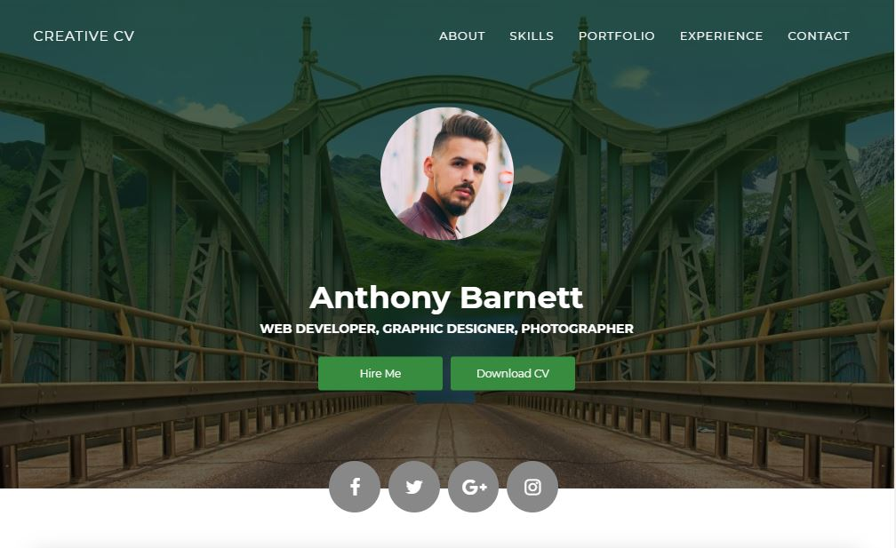

<h1 align="center" style="border-bottom: none !important; margin-bottom: 5px !important; text-decoration: none; font-size: 34px; color: #a89274;">
    Projet "My Creative CV"
</h1>
<h2 align="center" style="border-bottom: none !important; margin-bottom: 5px !important; text-decoration: none; font-size: 34px; color: #a89274;">
    Réaliser lors d'un cours html/css durant la formation de développeur web / web mobile à WebForce3, puis amélioré par la suite.
</h2>

    

    <h3> Que fallait-il faire?</h3>
    
Intégrer une maquette en HTML et CSS

    <ul style="list-style-type: none;">
        <li> - Récupérer le Zip contenant les maquettes et images </li>
        <li> - Ouvrir la maquette et voir comment la découper </li> 
        <li> - Création du dossier contenant le projet, ouverture dans VSCode </li>
        <li> - Création du fichier HTML avec les balises de départ </li>
        <li> - Création d'un dossier "src" qui contient un dossier "img" et "style", création des fichiers css dans "style" </li>
        <li> - Réalisation du "header" (html et css) </li>
        <li> - Réalisation de la partie "main" avec la partie "about" </li>
        <li> - Suite de la partie "main" avec la partie "skills" </li>
        <li> - Suite de la partie "main" avec la partie "portfolio", ajout d'images libre de droits dans le dossier "img" </li>
        <li> - Suite de la partie "main" avec la partie "expérience" suivi de la partie "formation", elles sont identique </li>
        <li> - Pour finir la partie "main" avec la partie "contact" et le "footer" contenant le copyright </li>
    </ul> 

